# 💻 P8-project-MLOps-Pret-a-Depenser

🔗 Liens du projet

🌐 Hugging Face Space : https://huggingface.co/spaces/amely188/P8-project-MLOps-Pret-a-Depenser

💻 GitHub Repository : https://github.com/masala-hadziavdic/P8-project-MLOps-Pret-a-Depenser.git

Table des matières

À propos du projet

Architecture

Schéma UML

Stack technique

Installation locale

Initialisation PostgreSQL

Lancement de l’API

Exemple d’utilisation

Tests & qualité

Traçabilité des prédictions

CI/CD & Déploiement

Auteur

---

📖 À propos du projet

Contexte du projet

Une entreprise spécialisée dans le crédit à la consommation souhaite améliorer son processus d’octroi de prêts, notamment pour des profils clients disposant de peu d’informations financières historiques.

Le modèle utilisé est un XGBoost pré-entraîné, exposé via une API FastAPI.

📊 Performances du modèle
Métrique	Valeur
ROC-AUC         0.7650
Seuil           0.64

🎯 Objectifs du projet

Concevoir un système de scoring capable de :
- Évaluer le risque de défaut de remboursement pour chaque demande
- Automatiser la prise de décision (acceptation ou refus du crédit)
- Suivre les performances du modèle en environnement de production
- Identifier les évolutions anormales des données (data drift)

🏗️ Architecture
Client
   ↓
FastAPI (app/main.py)
   ↓
prediction_service.py
   ↓
database.py
   ↓
PostgreSQL
📂 Rôle des fichiers principaux
Fichier	Description
app/main.py	Point d’entrée FastAPI
prediction_service.py	Logique métier
database.py	Connexion et gestion PostgreSQL
model.pkl	Modèle XGBoost
test_prediction_service.py	Tests unitaires
🗄️ Schéma UML de la Base de Données



> Le code source Mermaid est disponible dans [docs/schema_uml.md](docs/schema_uml.md)
⚙️ Stack technique & versions
Technologie	Version
Python	3.12
FastAPI	0.104+
XGBoost	3.0.4
Pandas	2.3+
NumPy	2.3+
PostgreSQL	13+
Psycopg2	2.9+
SQLAlchemy	2.0+
Pytest	7.4+
GitHub Actions	CI/CD
Hugging Face Spaces	Déploiement
## 💾 Installation locale
# Cloner le repository
```
git clone https://github.com/masala-hadziavdic/P8-project-MLOps-Pret-a-Depenser.git
cd C:\Users\amela\P8-project MLOps

# Créer environnement virtuel
python -m venv venv

# Activation Windows
venv\Scripts\activate

# Activation Linux/macOS
source venv/bin/activate

# Installer dépendances
pip install --upgrade pip
pip install -r requirements.txt
```
🐘 Initialisation PostgreSQL

## Créer une base SQL:
```sql
CREATE DATABASE mlops;
```

Configurer les variables d’environnement :
```
DB_HOST=localhost
DB_PORT=5432
DB_NAME=mlops
DB_USER=postgres
DB_PASSWORD=your_password
```
🚀 Lancement de l’API
```
uvicorn app.main:app --reload
```

Documentation Swagger disponible à :

http://127.0.0.1:8000/docs

📬 Exemple d’utilisation
```json
POST /predict
{
  "probability": 0.7388255596160889,
  "prediction": 1
}
```


## 🧪 Tests & Couverture

Une suite complète de tests unitaires et fonctionnels a été développée avec Pytest pour garantir la robustesse de model.

Les tests couvrent :
- Le bon fonctionnement des endpoints API (`/` et `/predict`)
- La validation des données via Pydantic
- Les cas d’erreurs (champs manquants, types invalides → 422)
- Le chargement du modèle ML
- L’intégration avec la base de données PostgreSQL

📊 **Rapport de couverture de tests :**
- Couverture globale : **80%**
- Outil utilisé : `pytest-cov`
- Rapport HTML généré dans `htmlcov/index.html` pour visualiser les parties testées et non testées.

📊 Traçabilité des prédictions

Chaque prédiction est stockée en base PostgreSQL :

Inputs utilisateur

Score de probabilité

Classe prédite

Timestamp

Cela garantit :

Auditabilité

Historique complet

Analyse future des performances

🔁 CI/CD & Déploiement

Pipeline GitHub Actions :

Exécution des tests

Vérification du chargement FastAPI

Déploiement automatique vers Hugging Face Space

Déploiement automatique vers :

👉 https://huggingface.co/spaces/amely188/P8-project-MLOps-Pret-a-Depenser

👩‍💻 Auteur

Support et contact
Auteur : masala-hadziavdic (amela188@hotmail.com)
Projet : Formation Data Scientist Machine Learning - OpenClassrooms
Repository : GitHub
Démo live : Hugging Face Spaces
Projet réalisé dans le cadre du Home Credit Default Risk - MLOps